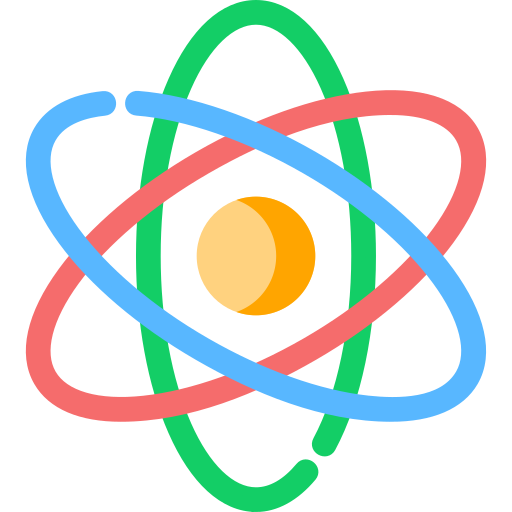

<!-- #  subhash.com &middot;   -->
<!-- 
The [adamalston.com](https://www.adamalston.com) website is built using [React](https://react.dev) and hosted on [Netlify](https://www.netlify.com). -->

This website is designed to be simple and accessible. Dynamic particles create an interactive experience for visitors. The site offers two themes via a toggle: a dark theme (default) and a light theme. The selected theme persists between tabs, windows, and page reloads.

Optimized for mobile devices with screen sizes ranging from 4-inch smartphones to 13-inch tablets.

##  Open source

This website is open source with the hope that others will use the code to create their own websites. 

  <b>Install and setup</b>

1. Clone this repository.
2. Install dependencies: `npm install`.
3. Start the development server: `npm start`.

<b>Build and deploy</b>

1. Create a production build: `npm run build`.
2. Refer to the [React Deployment](https://create-react-app.dev/docs/deployment) docs for deploying to `gh-pages`, Netlify, and other services.

## Thank you! ##

